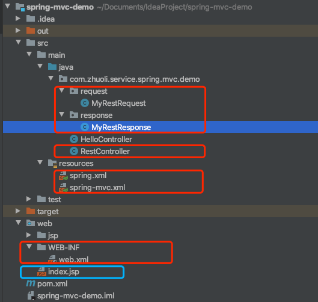
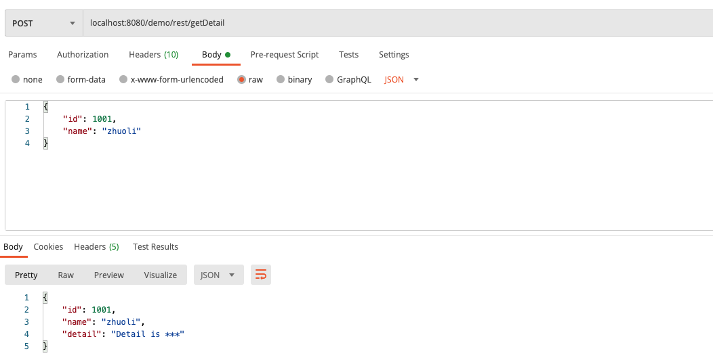
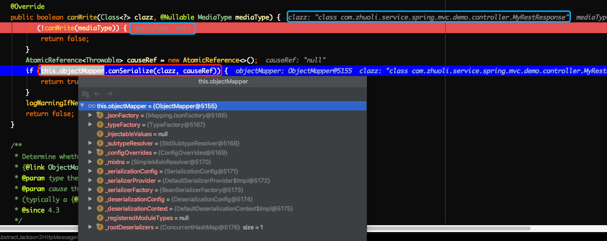
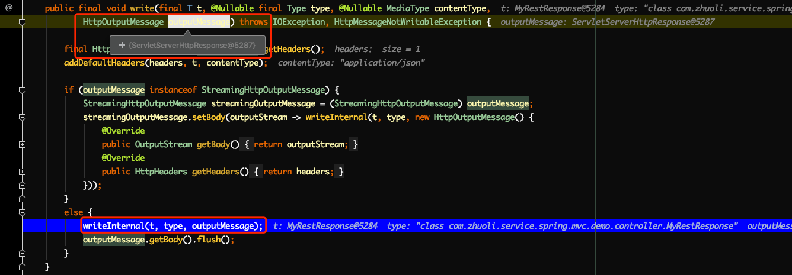
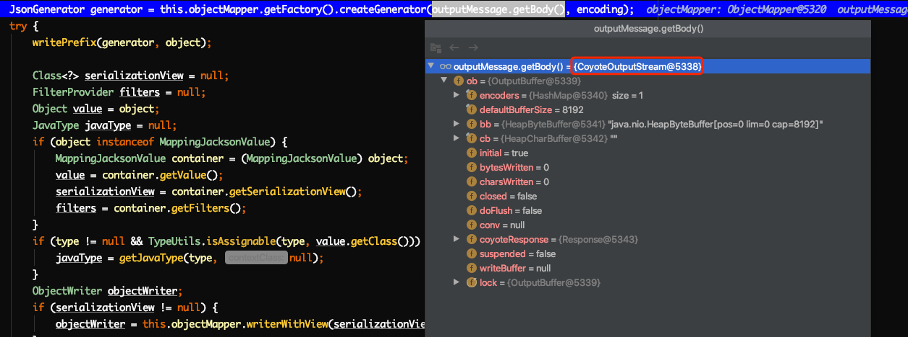

# [Spring MVC源码解读『Spring MVC如何提供Rest接口』](http://lidol.top/frame/3334/)

2021-01-08 分类：[Spring MVC源码](http://lidol.top/category/frame/sprinmvc_sc/) / [框架](http://lidol.top/category/frame/) 阅读(499) 评论(0)

上篇文章我们介绍了Spring MVC是如何响应前段Web请求的，文章中我们介绍了Controller和Jsp如何配合工作的（但其实文章大部分篇幅还是在介绍Controller，Jsp仅仅是在最后在DispatcherServlet中做了一个跳转）。因为在实际开发中，很少有这种使用Jsp的项目了，后端在开发过程中的角色一般都是提供业务数据，前端负责页面的展示和数据的组装（现在前段使用一些框架Vue、React甚至直接使用ajax都能很轻松实现这一点），类似于之前介绍MVC中提到的前后端分离的模式：

[](http://cdn.lidol.top/lidol_blog/mvvm_mvc.png)

也就是说后端完全不用管页面相关的东西了，只需要专注于业务逻辑就行了，这种开发模式下提供的接口我们一般称之为Rest接口。而要实现这种类型的接口，我们一般会使用到两个注解：@ResquestBody、@ResponseBody。

- @ResquestBody：将HTTP请求转换成Controller方法的请求参数POJO
- @ResponseBody：将Controller方法的返回值POJO输出到HTTP响应中

## 1. 示例

按照上图的开发模式，后端一般负责提供数据，一般前后端都通过Json交互。所以这里在之前文章[Spring MVC源码解读『Spring MVC示例』](http://lidol.top/frame/3197/)的基础上，开发一个使用Json进行交互的示例。

### 1.1 pom.xml

```
<?xml version="1.0" encoding="UTF-8"?>
<project xmlns="http://maven.apache.org/POM/4.0.0"
         xmlns:xsi="http://www.w3.org/2001/XMLSchema-instance"
         xsi:schemaLocation="http://maven.apache.org/POM/4.0.0 http://maven.apache.org/xsd/maven-4.0.0.xsd">
    <modelVersion>4.0.0</modelVersion>

    <groupId>groupId</groupId>
    <artifactId>spring-mvc-demo</artifactId>
    <version>1.0-SNAPSHOT</version>

    <dependencies>
        <!--添加Spring MVC的依赖-->
        <dependency>
            <groupId>org.springframework</groupId>
            <artifactId>spring-webmvc</artifactId>
            <version>5.0.7.RELEASE</version>
        </dependency>

        <!-- https://mvnrepository.com/artifact/javax.servlet/javax.servlet-api -->
        <dependency>
            <groupId>javax.servlet</groupId>
            <artifactId>javax.servlet-api</artifactId>
            <version>4.0.1</version>
            <scope>provided</scope>
        </dependency>

        <dependency>
            <groupId>javax.servlet</groupId>
            <artifactId>jstl</artifactId>
            <version>1.2</version>
        </dependency>

        <dependency>
            <groupId>com.fasterxml.jackson.core</groupId>
            <artifactId>jackson-core</artifactId>
            <version>2.12.0</version>
        </dependency>
        <dependency>
            <groupId>com.fasterxml.jackson.core</groupId>
            <artifactId>jackson-databind</artifactId>
            <version>2.12.0</version>
        </dependency>
        <dependency>
            <groupId>com.fasterxml.jackson.core</groupId>
            <artifactId>jackson-annotations</artifactId>
            <version>2.12.0</version>
        </dependency>

    </dependencies>
    
</project>
```

因为要支持Json输入输出，所以这里新引入了jackson相关的包。这里jackson相关包的引入非常重要，因为@RequestBody和@ResponseBody最终能生效，需要使用到**MappingJackson2HttpMessageConverter**这个转换器，而这个转换器的默认添加逻辑需要依赖jackson相关的两个类。这个下面详细介绍。

### 1.2 容器配置

spring.xml

```
<?xml version="1.0" encoding="UTF-8"?>
<beans xmlns="http://www.springframework.org/schema/beans"
       xmlns:xsi="http://www.w3.org/2001/XMLSchema-instance"
       xmlns:context="http://www.springframework.org/schema/context"
       xsi:schemaLocation="http://www.springframework.org/schema/beans
        http://www.springframework.org/schema/beans/spring-beans.xsd
        http://www.springframework.org/schema/context
        http://www.springframework.org/schema/context/spring-context.xsd">

    <!--启动DI管理-->
    <context:annotation-config/>

    <!-- 在父容器中不扫描@Controller注解，在子容器中只扫描@Controller注解 -->
    <!--把控制器从包扫描中排除出去-->
    <context:component-scan base-package="com.zhuoli.service.spring.mvc.demo">
        <context:exclude-filter type="annotation"
                                expression="org.springframework.stereotype.Controller"/>
    </context:component-scan>
</beans>
```

父容器的配置文件跟之前的文章保持一致。

spring-mvc.xml

```
<?xml version="1.0" encoding="UTF-8"?>
<beans xmlns="http://www.springframework.org/schema/beans"
       xmlns:xsi="http://www.w3.org/2001/XMLSchema-instance"
       xmlns:context="http://www.springframework.org/schema/context"
       xmlns:mvc="http://www.springframework.org/schema/mvc"
       xsi:schemaLocation="
        http://www.springframework.org/schema/beans
        http://www.springframework.org/schema/beans/spring-beans.xsd
        http://www.springframework.org/schema/context
        http://www.springframework.org/schema/context/spring-context.xsd
        http://www.springframework.org/schema/mvc
        http://www.springframework.org/schema/mvc/spring-mvc.xsd">


    <!-- 启用Spring基于annotation的DI, 使用户可以在Spring MVC中使用Spring的强大功能。
        激活 @Required, @Autowired,JSR 250's @PostConstruct, @PreDestroy and @Resource 等标注 -->
    <context:annotation-config/>

    <!--包扫描-->
    <!--DispatcherServlet上下文,只管理@Controller的bean,忽略其他类型的bean, 例如@Service-->
    <context:component-scan base-package="com.zhuoli.service.spring.mvc.demo">
        <context:include-filter type="annotation" expression="org.springframework.stereotype.Controller"/>
    </context:component-scan>

    <mvc:annotation-driven />

    <!--前缀加上后缀生成一个完整的jsp路径-->
    <bean class="org.springframework.web.servlet.view.InternalResourceViewResolver">
        <property name="viewClass" value="org.springframework.web.servlet.view.JstlView"/>
        <property name="prefix" value="/WEB-INF/jsp/"/>
        <property name="suffix" value=".jsp"/>
    </bean>

    <bean class="org.springframework.web.servlet.view.ContentNegotiatingViewResolver">
        <property name="order" value="1"/>
        <property name="defaultViews">
            <list>
                <!-- JSON View -->
                <bean
                        class="org.springframework.web.servlet.view.json.MappingJackson2JsonView">
                </bean>
            </list>
        </property>
    </bean>

</beans>
```

子容器配置文件spring-mvc.xml，跟之前的文章保持一致。

### 1.3 web资源配置

关于web资源配置，主要是用于配置tomcat配置文件web.xml，跟之前的文章保持一致即可，如下：

```
<?xml version="1.0" encoding="UTF-8"?>
<web-app xmlns="http://xmlns.jcp.org/xml/ns/javaee"
         xmlns:xsi="http://www.w3.org/2001/XMLSchema-instance"
         xsi:schemaLocation="http://xmlns.jcp.org/xml/ns/javaee http://xmlns.jcp.org/xml/ns/javaee/web-app_4_0.xsd"
         version="4.0">

    <display-name>Archetype Created Web Application</display-name>

    <!--指定Spring的配置文件地址-->
    <context-param>
        <param-name>contextConfigLocation</param-name>
        <param-value>classpath:spring.xml</param-value>
    </context-param>

    <!--Tomcat Context生命周期监听器-->
    <listener>
        <listener-class>org.springframework.web.context.ContextLoaderListener</listener-class>
    </listener>

    <!--配置Spring MVC 的DispatcherServlet,指定配置文件的路径,拦截所有的请求-->
    <servlet>
        <!--这个名称如果不特别指定的话，跟配置文件名称有关联。如果特别指定配置文件了，则此名称就无所谓了-->
        <servlet-name>springMvc</servlet-name>
        <servlet-class>org.springframework.web.servlet.DispatcherServlet</servlet-class>
        <init-param>
            <!--contextConfigLocation这个参数可以不配置，如果不配置的话，那么默认的value就是/WEB-INF/[servlet名字]-servlet.xml-->
            <param-name>contextConfigLocation</param-name>
            <param-value>classpath:spring-mvc.xml</param-value>
        </init-param>
        <!--表示启动容器时初始化该Servlet-->
        <load-on-startup>1</load-on-startup>
    </servlet>

    <servlet-mapping>
        <servlet-name>springMvc</servlet-name>
        <!--DispatcherServlet拦截所有的请求-->
        <url-pattern>/</url-pattern>
    </servlet-mapping>
</web-app>
```

同时我们再web根目录下，创建一个静态的index.jsp文件，以便方便我们确定Tomcat容器已经成功启动了（Tomcat成功启动后，会访问使用默认浏览器访问该index.jsp文件）。

```
<%@ page contentType="text/html;charset=UTF-8" language="java" %>
<html>
  <head>
    <title>$Title$</title>
  </head>
  <body>
  hello index.jsp
  </body>
</html>
```

### 1.4 Controller

```
@Controller
@RequestMapping("/demo/rest")
public class RestController {

    @RequestMapping(value = "/getDetail", method = RequestMethod.POST)
    @ResponseBody
    public MyRestResponse restTest(@RequestBody MyRestRequest request) {
        MyRestResponse myRestResponse = new MyRestResponse();
        myRestResponse.setId(request.getId());
        myRestResponse.setName(request.getName());
        myRestResponse.setDetail("Detail is ***");

        return myRestResponse;
    }
}
public class MyRestRequest {
    private Long id;

    private String name;

    public Long getId() {
        return id;
    }

    public String getName() {
        return name;
    }

    public void setId(Long id) {
        this.id = id;
    }

    public void setName(String name) {
        this.name = name;
    }
}

public class MyRestResponse {
    private Long id;

    private String name;

    private String detail;

    public Long getId() {
        return id;
    }

    public String getName() {
        return name;
    }

    public String getDetail() {
        return detail;
    }

    public void setId(Long id) {
        this.id = id;
    }

    public void setName(String name) {
        this.name = name;
    }

    public void setDetail(String detail) {
        this.detail = detail;
    }
}
```

[](http://cdn.lidol.top/lidol_blog/20210111082139.png)

使用PostMan发送请求：

[](http://cdn.lidol.top/lidol_blog/20210111082236.png)

可以看到，我们的Spring MVC应用已经可以通过Json进行交互了。

## 2. 源码分析

接下来我们来具体看一下，Spring MVC如何使用@ResquestBody、@ResponseBody这两个注解完成HTTP请求和响应与POJO之间是如何转换的。

上篇文章，我们介绍到，Spring MVC分别使用**HandlerMethodArgumentResolver**和**HandlerMethodReturnValueHandler**完成**解析HTTP报文中对应的方法参数**以及**返回值解析为HTTP响应报文**。但是对于HandlerMethodArgumentResolver和HandlerMethodReturnValueHandler是如何完成解析的，并没有详细介绍。其实HandlerMethodArgumentResolver和HandlerMethodReturnValueHandler最终是通过HttpMessageConverter来完成的转换。

```
public interface HttpMessageConverter<T> {

    // 当前转换器是否能将HTTP报文转换为对象类型
    boolean canRead(Class<?> clazz, @Nullable MediaType mediaType);

    // 当前转换器是否能将对象类型转换为HTTP报文
    boolean canWrite(Class<?> clazz, @Nullable MediaType mediaType);

    // 转换器能支持的HTTP媒体类型
    List<MediaType> getSupportedMediaTypes();

    // 转换HTTP报文为特定类型POJO
    T read(Class<? extends T> clazz, HttpInputMessage inputMessage)
            throws IOException, HttpMessageNotReadableException;

    // 将特定类型对象转换为HTTP报文
    void write(T t, @Nullable MediaType contentType, HttpOutputMessage outputMessage)
            throws IOException, HttpMessageNotWritableException;

}
public interface HandlerMethodArgumentResolver {

    // 参数解析器是否支持方法参数
    boolean supportsParameter(MethodParameter parameter);

    // 解析HTTP报文中对应的方法参数
    @Nullable
    Object resolveArgument(MethodParameter parameter, @Nullable ModelAndViewContainer mavContainer,
            NativeWebRequest webRequest, @Nullable WebDataBinderFactory binderFactory) throws Exception;

}
public interface HandlerMethodReturnValueHandler {

    // 返回值处理器是否支持返回值类型
    boolean supportsReturnType(MethodParameter returnType);

    // 将返回值解析为HTTP响应报文
    void handleReturnValue(@Nullable Object returnValue, MethodParameter returnType,
            ModelAndViewContainer mavContainer, NativeWebRequest webRequest) throws Exception;

}
```

那么可以想象，HandlerMethodArgumentResolver和HandlerMethodReturnValueHandler的实现类中肯定持有HttpMessageConverter类型的成员。并使用HttpMessageConverter的方法来实现resolveArgument和handleReturnValue。

上篇文章介绍过，Spring MVC通过RequestResponseBodyMethodProcessor来处理@RequestBody和@ResponseBody两个注解，RequestResponseBodyMethodProcessor实现了HandlerMethodArgumentResolver和HandlerMethodReturnValueHandler两个接口。接下来就来看一下RequestResponseBodyMethodProcessor是如何完成上述两个注解的解析的。

上篇文章我们也介绍到，请求处理过程中会调用org.springframework.web.servlet.mvc.method.annotation.ServletInvocableHandlerMethod#invokeAndHandle方法来处理。

```
public void invokeAndHandle(ServletWebRequest webRequest, ModelAndViewContainer mavContainer,
        Object... providedArgs) throws Exception {

    // 1. 执行请求
    Object returnValue = invokeForRequest(webRequest, mavContainer, providedArgs);
    setResponseStatus(webRequest);

    if (returnValue == null) {
        if (isRequestNotModified(webRequest) || getResponseStatus() != null || mavContainer.isRequestHandled()) {
            mavContainer.setRequestHandled(true);
            return;
        }
    }
    else if (StringUtils.hasText(getResponseStatusReason())) {
        mavContainer.setRequestHandled(true);
        return;
    }

    mavContainer.setRequestHandled(false);
    Assert.state(this.returnValueHandlers != null, "No return value handlers");
    try {
        // 返回值处理
        this.returnValueHandlers.handleReturnValue(
                returnValue, getReturnValueType(returnValue), mavContainer, webRequest);
    }
    catch (Exception ex) {
        if (logger.isTraceEnabled()) {
            logger.trace(getReturnValueHandlingErrorMessage("Error handling return value", returnValue), ex);
        }
        throw ex;
    }
}
```

很明显，存在一个参数解析和返回值处理的过程，分别对应于invokeForRequest和handleReturnValue。下面，我们分别详细来介绍。

### 2.1 参数解析

```
public Object invokeForRequest(NativeWebRequest request, @Nullable ModelAndViewContainer mavContainer,
        Object... providedArgs) throws Exception {

    // 1. 获取方法实参列表
    Object[] args = getMethodArgumentValues(request, mavContainer, providedArgs);
    if (logger.isTraceEnabled()) {
        logger.trace("Invoking '" + ClassUtils.getQualifiedMethodName(getMethod(), getBeanType()) +
                "' with arguments " + Arrays.toString(args));
    }
    // 2. 反射Controller方法，获取方法返回值
    Object returnValue = doInvoke(args);
    if (logger.isTraceEnabled()) {
        logger.trace("Method [" + ClassUtils.getQualifiedMethodName(getMethod(), getBeanType()) +
                "] returned [" + returnValue + "]");
    }
    return returnValue;
}
private Object[] getMethodArgumentValues(NativeWebRequest request, @Nullable ModelAndViewContainer mavContainer,
        Object... providedArgs) throws Exception {

    MethodParameter[] parameters = getMethodParameters();
    Object[] args = new Object[parameters.length];
    // 遍历方法参数，从HTTP Request中解析请求内容到参数args中
    for (int i = 0; i < parameters.length; i++) {
        MethodParameter parameter = parameters[i];
        parameter.initParameterNameDiscovery(this.parameterNameDiscoverer);
        args[i] = resolveProvidedArgument(parameter, providedArgs);
        if (args[i] != null) {
            continue;
        }
        // 使用argumentResolvers解析参数
        if (this.argumentResolvers.supportsParameter(parameter)) {
            try {
                args[i] = this.argumentResolvers.resolveArgument(
                        parameter, mavContainer, request, this.dataBinderFactory);
                continue;
            }
            catch (Exception ex) {
                if (logger.isDebugEnabled()) {
                    logger.debug(getArgumentResolutionErrorMessage("Failed to resolve", i), ex);
                }
                throw ex;
            }
        }
        if (args[i] == null) {
            throw new IllegalStateException("Could not resolve method parameter at index " +
                    parameter.getParameterIndex() + " in " + parameter.getExecutable().toGenericString() +
                    ": " + getArgumentResolutionErrorMessage("No suitable resolver for", i));
        }
    }
    return args;
}
```

方法里的argumentResolvers其实就是通过RequestMappingHandlerAdapter的成员变量argumentResolvers初始化的。而argumentResolvers类型为HandlerMethodArgumentResolverComposite，其实就是多个HandlerMethodArgumentResolver的集合。HandlerMethodArgumentResolverComposite的supportsParameter其实就是判断内部HandlerMethodArgumentResolver集合中是否存在支持解析该参数类型的解析器；HandlerMethodArgumentResolverComposite的resolveArgument方法其实就是使用内部HandlerMethodArgumentResolver集合中的某一解析器解析参数。

我们来看看之前提到的RequestResponseBodyMethodProcessor，是如何解析参数的。

```
public boolean supportsParameter(MethodParameter parameter) {
    return parameter.hasParameterAnnotation(RequestBody.class);
}
```

首先是supportsParameter方法，可以看到，RequestResponseBodyMethodProcessor支持解析的参数类型为，存在RequestBody注解的参数。再看一下RequestResponseBodyMethodProcessor是如何解析参数的：

```
public Object resolveArgument(MethodParameter parameter, @Nullable ModelAndViewContainer mavContainer,
        NativeWebRequest webRequest, @Nullable WebDataBinderFactory binderFactory) throws Exception {

    parameter = parameter.nestedIfOptional();
    // 使用HttpMessageConverter，解析参数
    Object arg = readWithMessageConverters(webRequest, parameter, parameter.getNestedGenericParameterType());
    String name = Conventions.getVariableNameForParameter(parameter);

    if (binderFactory != null) {
        WebDataBinder binder = binderFactory.createBinder(webRequest, arg, name);
        if (arg != null) {
            validateIfApplicable(binder, parameter);
            if (binder.getBindingResult().hasErrors() && isBindExceptionRequired(binder, parameter)) {
                throw new MethodArgumentNotValidException(parameter, binder.getBindingResult());
            }
        }
        if (mavContainer != null) {
            mavContainer.addAttribute(BindingResult.MODEL_KEY_PREFIX + name, binder.getBindingResult());
        }
    }

    return adaptArgumentIfNecessary(arg, parameter);
}
protected <T> Object readWithMessageConverters(NativeWebRequest webRequest, MethodParameter parameter,
        Type paramType) throws IOException, HttpMediaTypeNotSupportedException, HttpMessageNotReadableException {

    HttpServletRequest servletRequest = webRequest.getNativeRequest(HttpServletRequest.class);
    Assert.state(servletRequest != null, "No HttpServletRequest");
    ServletServerHttpRequest inputMessage = new ServletServerHttpRequest(servletRequest);

    // 使用HttpMessageConverter，解析参数
    Object arg = readWithMessageConverters(inputMessage, parameter, paramType);
    if (arg == null && checkRequired(parameter)) {
        throw new HttpMessageNotReadableException("Required request body is missing: " +
                parameter.getExecutable().toGenericString());
    }
    return arg;
}
protected <T> Object readWithMessageConverters(HttpInputMessage inputMessage, MethodParameter parameter,
        Type targetType) throws IOException, HttpMediaTypeNotSupportedException, HttpMessageNotReadableException {

    MediaType contentType;
    boolean noContentType = false;
    try {
        contentType = inputMessage.getHeaders().getContentType();
    }
    catch (InvalidMediaTypeException ex) {
        throw new HttpMediaTypeNotSupportedException(ex.getMessage());
    }
    if (contentType == null) {
        noContentType = true;
        contentType = MediaType.APPLICATION_OCTET_STREAM;
    }

    Class<?> contextClass = parameter.getContainingClass();
    Class<T> targetClass = (targetType instanceof Class ? (Class<T>) targetType : null);
    if (targetClass == null) {
        ResolvableType resolvableType = ResolvableType.forMethodParameter(parameter);
        targetClass = (Class<T>) resolvableType.resolve();
    }

    HttpMethod httpMethod = (inputMessage instanceof HttpRequest ? ((HttpRequest) inputMessage).getMethod() : null);
    Object body = NO_VALUE;

    EmptyBodyCheckingHttpInputMessage message;
    try {
        message = new EmptyBodyCheckingHttpInputMessage(inputMessage);

        // 遍历HttpMessageConverter，转换HTTP Request
        for (HttpMessageConverter<?> converter : this.messageConverters) {
            Class<HttpMessageConverter<?>> converterType = (Class<HttpMessageConverter<?>>) converter.getClass();
            GenericHttpMessageConverter<?> genericConverter =
                    (converter instanceof GenericHttpMessageConverter ? (GenericHttpMessageConverter<?>) converter : null);
            // 当前HttpMessageConverter是否支持转换
            if (genericConverter != null ? genericConverter.canRead(targetType, contextClass, contentType) :
                    (targetClass != null && converter.canRead(targetClass, contentType))) {
                if (logger.isDebugEnabled()) {
                    logger.debug("Read [" + targetType + "] as \"" + contentType + "\" with [" + converter + "]");
                }
                if (message.hasBody()) {
                    HttpInputMessage msgToUse =
                            getAdvice().beforeBodyRead(message, parameter, targetType, converterType);
                    // 调用HttpMessageConverter的read方法，转换HTTP Request
                    body = (genericConverter != null ? genericConverter.read(targetType, contextClass, msgToUse) :
                            ((HttpMessageConverter<T>) converter).read(targetClass, msgToUse));
                    body = getAdvice().afterBodyRead(body, msgToUse, parameter, targetType, converterType);
                }
                else {
                    body = getAdvice().handleEmptyBody(null, message, parameter, targetType, converterType);
                }
                break;
            }
        }
    }
    catch (IOException ex) {
        throw new HttpMessageNotReadableException("I/O error while reading input message", ex);
    }

    if (body == NO_VALUE) {
        if (httpMethod == null || !SUPPORTED_METHODS.contains(httpMethod) ||
                (noContentType && !message.hasBody())) {
            return null;
        }
        throw new HttpMediaTypeNotSupportedException(contentType, this.allSupportedMediaTypes);
    }

    return body;
}
```

所以其实HandlerMethodArgumentResolver解析HTTP Request的过程，就是调用HttpMessageConverter的read方法实现的。关于HttpMessageConverter，Spring MVC默认帮我们初始化了一些类型的Converter，在<mvc:annotation-driven>标签的解析器AnnotationDrivenBeanDefinitionParser，会生成一些默认的HttpMessageConverter，并添加到RequestMappingHandlerAdapter BeanDefinition中。如下：

```
private ManagedList<?> getMessageConverters(Element element, @Nullable Object source, ParserContext parserContext) {
    Element convertersElement = DomUtils.getChildElementByTagName(element, "message-converters");
    ManagedList<? super Object> messageConverters = new ManagedList<>();
    if (convertersElement != null) {
        messageConverters.setSource(source);
        for (Element beanElement : DomUtils.getChildElementsByTagName(convertersElement, "bean", "ref")) {
            Object object = parserContext.getDelegate().parsePropertySubElement(beanElement, null);
            messageConverters.add(object);
        }
    }

    if (convertersElement == null || Boolean.valueOf(convertersElement.getAttribute("register-defaults"))) {
        messageConverters.setSource(source);
        messageConverters.add(createConverterDefinition(ByteArrayHttpMessageConverter.class, source));

        RootBeanDefinition stringConverterDef = createConverterDefinition(StringHttpMessageConverter.class, source);
        stringConverterDef.getPropertyValues().add("writeAcceptCharset", false);
        messageConverters.add(stringConverterDef);

        messageConverters.add(createConverterDefinition(ResourceHttpMessageConverter.class, source));
        messageConverters.add(createConverterDefinition(ResourceRegionHttpMessageConverter.class, source));
        messageConverters.add(createConverterDefinition(SourceHttpMessageConverter.class, source));
        messageConverters.add(createConverterDefinition(AllEncompassingFormHttpMessageConverter.class, source));

        if (romePresent) {
            messageConverters.add(createConverterDefinition(AtomFeedHttpMessageConverter.class, source));
            messageConverters.add(createConverterDefinition(RssChannelHttpMessageConverter.class, source));
        }

        if (jackson2XmlPresent) {
            Class<?> type = MappingJackson2XmlHttpMessageConverter.class;
            RootBeanDefinition jacksonConverterDef = createConverterDefinition(type, source);
            GenericBeanDefinition jacksonFactoryDef = createObjectMapperFactoryDefinition(source);
            jacksonFactoryDef.getPropertyValues().add("createXmlMapper", true);
            jacksonConverterDef.getConstructorArgumentValues().addIndexedArgumentValue(0, jacksonFactoryDef);
            messageConverters.add(jacksonConverterDef);
        }
        else if (jaxb2Present) {
            messageConverters.add(createConverterDefinition(Jaxb2RootElementHttpMessageConverter.class, source));
        }

        if (jackson2Present) {
            Class<?> type = MappingJackson2HttpMessageConverter.class;
            RootBeanDefinition jacksonConverterDef = createConverterDefinition(type, source);
            GenericBeanDefinition jacksonFactoryDef = createObjectMapperFactoryDefinition(source);
            jacksonConverterDef.getConstructorArgumentValues().addIndexedArgumentValue(0, jacksonFactoryDef);
            messageConverters.add(jacksonConverterDef);
        }
        else if (gsonPresent) {
            messageConverters.add(createConverterDefinition(GsonHttpMessageConverter.class, source));
        }

        if (jackson2SmilePresent) {
            Class<?> type = MappingJackson2SmileHttpMessageConverter.class;
            RootBeanDefinition jacksonConverterDef = createConverterDefinition(type, source);
            GenericBeanDefinition jacksonFactoryDef = createObjectMapperFactoryDefinition(source);
            jacksonFactoryDef.getPropertyValues().add("factory", new SmileFactory());
            jacksonConverterDef.getConstructorArgumentValues().addIndexedArgumentValue(0, jacksonFactoryDef);
            messageConverters.add(jacksonConverterDef);
        }
        if (jackson2CborPresent) {
            Class<?> type = MappingJackson2CborHttpMessageConverter.class;
            RootBeanDefinition jacksonConverterDef = createConverterDefinition(type, source);
            GenericBeanDefinition jacksonFactoryDef = createObjectMapperFactoryDefinition(source);
            jacksonFactoryDef.getPropertyValues().add("factory", new CBORFactory());
            jacksonConverterDef.getConstructorArgumentValues().addIndexedArgumentValue(0, jacksonFactoryDef);
            messageConverters.add(jacksonConverterDef);
        }
    }
    return messageConverters;
}
```

可以看到，Spring MVC默认为我们生成了很多HttpMessageConverter，比如我们这里Json进行前后端交互需要使用到的MappingJackson2HttpMessageConverter，就有一个添加的条件**jackson2Present**。

```
private static final boolean jackson2Present =
    ClassUtils.isPresent("com.fasterxml.jackson.databind.ObjectMapper",
            AnnotationDrivenBeanDefinitionParser.class.getClassLoader()) &&
    ClassUtils.isPresent("com.fasterxml.jackson.core.JsonGenerator",
            AnnotationDrivenBeanDefinitionParser.class.getClassLoader());
```

所以，只要我们引入上述pom.xml中jackson相关的包，这里Spring MVC就会默认帮我们向容器中添加MappingJackson2HttpMessageConverter。所以也不需要我们再spring-mvc.xml配置文件中手动添加HttpMessageConverter了，如下所示：

```
<mvc:annotation-driven>
    <mvc:message-converters>
        <bean class="org.springframework.http.converter.json.MappingJackson2HttpMessageConverter"/>
    </mvc:message-converters>
</mvc:annotation-driven>
```

最后我们看一下，MappingJackson2HttpMessageConverter是如何解析参数的。

```
@Override
public boolean canRead(Class<?> clazz, @Nullable MediaType mediaType) {
    return canRead(clazz, null, mediaType);
}

@Override
public boolean canRead(Type type, @Nullable Class<?> contextClass, @Nullable MediaType mediaType) {
    if (!canRead(mediaType)) {
        return false;
    }
    JavaType javaType = getJavaType(type, contextClass);
    AtomicReference<Throwable> causeRef = new AtomicReference<>();
    if (this.objectMapper.canDeserialize(javaType, causeRef)) {
        return true;
    }
    logWarningIfNecessary(javaType, causeRef.get());
    return false;
}
```

首先是canRead，判断MappingJackson2HttpMessageConverter是否支持转换当前转换（将HTTP请求内容转换为@RequestBody标注的java对象）。其实就是使用jackson的objectMapper判断是否可以反序列化当前Java类型。

```
@Override
public final T read(Class<? extends T> clazz, HttpInputMessage inputMessage) throws IOException {
    return readInternal(clazz, inputMessage);
}

@Override
protected Object readInternal(Class<?> clazz, HttpInputMessage inputMessage)
        throws IOException, HttpMessageNotReadableException {

    JavaType javaType = getJavaType(clazz, null);
    return readJavaType(javaType, inputMessage);
}

private Object readJavaType(JavaType javaType, HttpInputMessage inputMessage) throws IOException {
    try {
        if (inputMessage instanceof MappingJacksonInputMessage) {
            Class<?> deserializationView = ((MappingJacksonInputMessage) inputMessage).getDeserializationView();
            if (deserializationView != null) {
                return this.objectMapper.readerWithView(deserializationView).forType(javaType).
                        readValue(inputMessage.getBody());
            }
        }
        return this.objectMapper.readValue(inputMessage.getBody(), javaType);
    }
    catch (InvalidDefinitionException ex) {
        throw new HttpMessageConversionException("Type definition error: " + ex.getType(), ex);
    }
    catch (JsonProcessingException ex) {
        throw new HttpMessageNotReadableException("JSON parse error: " + ex.getOriginalMessage(), ex);
    }
}
```

read方法也非常简单，其实就是使用objectMapper的readValue方法，将请求体内容解析为Java对象。

### 2.2 返回值处理

介绍完Spring MVC是如使用MappingJackson2HttpMessageConverter让@RequestBody生效的（参数解析过程），接下来我们看一下Spring MVC @ResponseBody的返回值处理过程。

在org.springframework.web.servlet.mvc.method.annotation.ServletInvocableHandlerMethod#invokeAndHandle方法中，有如下一段逻辑：

```
// 返回值处理
this.returnValueHandlers.handleReturnValue(
    returnValue, getReturnValueType(returnValue), mavContainer, webRequest);
```

这里的returnValueHandlers，本源来自于RequestMappingHandlerAdapter，类型为org.springframework.web.method.support.HandlerMethodReturnValueHandlerComposite，其实是HandlerMethodReturnValueHandler的集合。HandlerMethodReturnValueHandlerComposite提供的一些方法，都适合基于内部HandlerMethodReturnValueHandler的集合实现的。我们来看一下返回值处理方法handleReturnValue：

```
@Override
public void handleReturnValue(@Nullable Object returnValue, MethodParameter returnType,
        ModelAndViewContainer mavContainer, NativeWebRequest webRequest) throws Exception {

    // 1. 从集合中选择合适的的HandlerMethodReturnValueHandler
    HandlerMethodReturnValueHandler handler = selectHandler(returnValue, returnType);
    if (handler == null) {
        throw new IllegalArgumentException("Unknown return value type: " + returnType.getParameterType().getName());
    }
    // 2. 调用HandlerMethodReturnValueHandler的handleReturnValue方法处理返回值
    handler.handleReturnValue(returnValue, returnType, mavContainer, webRequest);
}
```

继续来看一下如何选择HandlerMethodReturnValueHandler的：

```
private HandlerMethodReturnValueHandler selectHandler(@Nullable Object value, MethodParameter returnType) {
    boolean isAsyncValue = isAsyncReturnValue(value, returnType);
    // 遍历returnValueHandlers，如果当前HandlerMethodReturnValueHandler支持该returnType，返回
    for (HandlerMethodReturnValueHandler handler : this.returnValueHandlers) {
        if (isAsyncValue && !(handler instanceof AsyncHandlerMethodReturnValueHandler)) {
            continue;
        }
        if (handler.supportsReturnType(returnType)) {
            return handler;
        }
    }
    return null;
}
```

上面介绍过，@ResponseBody注解对应的ReturnValueHandler为RequestResponseBodyMethodProcessor，所以我们来看一下RequestResponseBodyMethodProcessor的supportsReturnType方法：

```
@Override
public boolean supportsReturnType(MethodParameter returnType) {
    return (AnnotatedElementUtils.hasAnnotation(returnType.getContainingClass(), ResponseBody.class) ||
            returnType.hasMethodAnnotation(ResponseBody.class));
}
```

也印证了，RequestResponseBodyMethodProcessor可以用于处理@ResponseBody返回值。

接下来具体来看一下RequestResponseBodyMethodProcessor是如何处理@ResponseBody返回值的。

```
@Override
public void handleReturnValue(@Nullable Object returnValue, MethodParameter returnType,
        ModelAndViewContainer mavContainer, NativeWebRequest webRequest)
        throws IOException, HttpMediaTypeNotAcceptableException, HttpMessageNotWritableException {

    mavContainer.setRequestHandled(true);
    ServletServerHttpRequest inputMessage = createInputMessage(webRequest);
    ServletServerHttpResponse outputMessage = createOutputMessage(webRequest);

    // 使用HttpMessageConverter处理返回值
    writeWithMessageConverters(returnValue, returnType, inputMessage, outputMessage);
}
protected <T> void writeWithMessageConverters(@Nullable T value, MethodParameter returnType,
        ServletServerHttpRequest inputMessage, ServletServerHttpResponse outputMessage)
        throws IOException, HttpMediaTypeNotAcceptableException, HttpMessageNotWritableException {

    // 1. 确定outputValue（返回值对象，Controller Method返回）
    // valueType（返回值Class类型）
    // declaredType（这里跟valueType一致）
    Object outputValue;
    Class<?> valueType;
    Type declaredType;

    if (value instanceof CharSequence) {
        outputValue = value.toString();
        valueType = String.class;
        declaredType = String.class;
    }
    else {
        outputValue = value;
        valueType = getReturnValueType(outputValue, returnType);
        declaredType = getGenericType(returnType);
    }
    
    if (isResourceType(value, returnType)) {
        outputMessage.getHeaders().set(HttpHeaders.ACCEPT_RANGES, "bytes");
        if (value != null && inputMessage.getHeaders().getFirst(HttpHeaders.RANGE) != null) {
            Resource resource = (Resource) value;
            try {
                List<HttpRange> httpRanges = inputMessage.getHeaders().getRange();
                outputMessage.getServletResponse().setStatus(HttpStatus.PARTIAL_CONTENT.value());
                outputValue = HttpRange.toResourceRegions(httpRanges, resource);
                valueType = outputValue.getClass();
                declaredType = RESOURCE_REGION_LIST_TYPE;
            }
            catch (IllegalArgumentException ex) {
                outputMessage.getHeaders().set(HttpHeaders.CONTENT_RANGE, "bytes */" + resource.contentLength());
                outputMessage.getServletResponse().setStatus(HttpStatus.REQUESTED_RANGE_NOT_SATISFIABLE.value());
            }
        }
    }


    // 2. 确定返回类型mediaType
    List<MediaType> mediaTypesToUse;

    MediaType contentType = outputMessage.getHeaders().getContentType();
    if (contentType != null && contentType.isConcrete()) {
        mediaTypesToUse = Collections.singletonList(contentType);
    }
    else {
        HttpServletRequest request = inputMessage.getServletRequest();
        List<MediaType> requestedMediaTypes = getAcceptableMediaTypes(request);
        List<MediaType> producibleMediaTypes = getProducibleMediaTypes(request, valueType, declaredType);

        if (outputValue != null && producibleMediaTypes.isEmpty()) {
            throw new HttpMessageNotWritableException(
                    "No converter found for return value of type: " + valueType);
        }
        mediaTypesToUse = new ArrayList<>();
        for (MediaType requestedType : requestedMediaTypes) {
            for (MediaType producibleType : producibleMediaTypes) {
                if (requestedType.isCompatibleWith(producibleType)) {
                    mediaTypesToUse.add(getMostSpecificMediaType(requestedType, producibleType));
                }
            }
        }
        if (mediaTypesToUse.isEmpty()) {
            if (outputValue != null) {
                throw new HttpMediaTypeNotAcceptableException(producibleMediaTypes);
            }
            return;
        }
        MediaType.sortBySpecificityAndQuality(mediaTypesToUse);
    }

    MediaType selectedMediaType = null;
    for (MediaType mediaType : mediaTypesToUse) {
        if (mediaType.isConcrete()) {
            selectedMediaType = mediaType;
            break;
        }
        else if (mediaType.equals(MediaType.ALL) || mediaType.equals(MEDIA_TYPE_APPLICATION)) {
            selectedMediaType = MediaType.APPLICATION_OCTET_STREAM;
            break;
        }
    }

    // 3. 遍历messageConverters，选择合适的HttpMessageConverter，调用write方法，将返回值returnValue转换为HTTP返回值
    if (selectedMediaType != null) {
        selectedMediaType = selectedMediaType.removeQualityValue();
        for (HttpMessageConverter<?> converter : this.messageConverters) {
            GenericHttpMessageConverter genericConverter =
                    (converter instanceof GenericHttpMessageConverter ? (GenericHttpMessageConverter<?>) converter : null);
            if (genericConverter != null ?
                    ((GenericHttpMessageConverter) converter).canWrite(declaredType, valueType, selectedMediaType) :
                    converter.canWrite(valueType, selectedMediaType)) {
                outputValue = (T) getAdvice().beforeBodyWrite(outputValue, returnType, selectedMediaType,
                        (Class<? extends HttpMessageConverter<?>>) converter.getClass(),
                        inputMessage, outputMessage);
                if (outputValue != null) {
                    addContentDispositionHeader(inputMessage, outputMessage);
                    if (genericConverter != null) {
                        genericConverter.write(outputValue, declaredType, selectedMediaType, outputMessage);
                    }
                    else {
                        ((HttpMessageConverter) converter).write(outputValue, selectedMediaType, outputMessage);
                    }
                    if (logger.isDebugEnabled()) {
                        logger.debug("Written [" + outputValue + "] as \"" + selectedMediaType +
                                "\" using [" + converter + "]");
                    }
                }
                return;
            }
        }
    }

    if (outputValue != null) {
        throw new HttpMediaTypeNotAcceptableException(this.allSupportedMediaTypes);
    }
}
```

[](http://cdn.lidol.top/lidol_blog/20210117074759.png)

核心就在HttpMessageConverter选择上，我们上面介绍过，@ResponseBody注解会使用MappingJackson2HttpMessageConverter完成返回值转换。所以来看一下MappingJackson2HttpMessageConverter是如何支持的，首先是canWrite方法：

```
public boolean canWrite(Class<?> clazz, @Nullable MediaType mediaType) {
    if (!canWrite(mediaType)) {
        return false;
    }
    AtomicReference<Throwable> causeRef = new AtomicReference<>();
    if (this.objectMapper.canSerialize(clazz, causeRef)) {
        return true;
    }
    logWarningIfNecessary(clazz, causeRef.get());
    return false;
}
```

该方法定义在MappingJackson2HttpMessageConverter的父类AbstractJackson2HttpMessageConverter中，其实就是判断objectMapper是否能够序列化该类型的对象，其中objectMapper在构造函数中指定：

```
public MappingJackson2HttpMessageConverter() {
    this(Jackson2ObjectMapperBuilder.json().build());
}
```

即Jackson2ObjectMapperBuilder.json().build()。

[](http://cdn.lidol.top/lidol_blog/20210117074418.png)

所以这里canSerialize方法返回值为true，可以使用MappingJackson2HttpMessageConverter转换返回值对象。

接下来我们来看一下MappingJackson2HttpMessageConverter的write方法，该方法定义在其父类AbstractGenericHttpMessageConverter中：

```
public final void write(final T t, @Nullable final Type type, @Nullable MediaType contentType,
        HttpOutputMessage outputMessage) throws IOException, HttpMessageNotWritableException {

    final HttpHeaders headers = outputMessage.getHeaders();
    addDefaultHeaders(headers, t, contentType);

    if (outputMessage instanceof StreamingHttpOutputMessage) {
        StreamingHttpOutputMessage streamingOutputMessage = (StreamingHttpOutputMessage) outputMessage;
        streamingOutputMessage.setBody(outputStream -> writeInternal(t, type, new HttpOutputMessage() {
            @Override
            public OutputStream getBody() {
                return outputStream;
            }
            @Override
            public HttpHeaders getHeaders() {
                return headers;
            }
        }));
    }
    else {
        writeInternal(t, type, outputMessage);
        outputMessage.getBody().flush();
    }
}
```

[](http://cdn.lidol.top/lidol_blog/20210117074920.png)

这里outputMessage类型为ServletServerHttpResponse，非StreamingHttpOutputMessage实例，所以会调用writeInternal方法，而writeInternal方法在AbstractGenericHttpMessageConverter是抽象方法，子类AbstractJackson2HttpMessageConverter实现了该方法：

```
protected void writeInternal(Object object, @Nullable Type type, HttpOutputMessage outputMessage)
        throws IOException, HttpMessageNotWritableException {

    MediaType contentType = outputMessage.getHeaders().getContentType();
    JsonEncoding encoding = getJsonEncoding(contentType);
    // 构建输出序列化使用的JsonGenerator，注意这里初始化时使用的outputMessage.getBody()
    JsonGenerator generator = this.objectMapper.getFactory().createGenerator(outputMessage.getBody(), encoding);
    try {
        writePrefix(generator, object);

        Class<?> serializationView = null;
        FilterProvider filters = null;
        Object value = object;
        JavaType javaType = null;
        if (object instanceof MappingJacksonValue) {
            MappingJacksonValue container = (MappingJacksonValue) object;
            value = container.getValue();
            serializationView = container.getSerializationView();
            filters = container.getFilters();
        }
        if (type != null && TypeUtils.isAssignable(type, value.getClass())) {
            javaType = getJavaType(type, null);
        }
        ObjectWriter objectWriter;
        if (serializationView != null) {
            objectWriter = this.objectMapper.writerWithView(serializationView);
        }
        else if (filters != null) {
            objectWriter = this.objectMapper.writer(filters);
        }
        else {
            objectWriter = this.objectMapper.writer();
        }
        if (javaType != null && javaType.isContainerType()) {
            objectWriter = objectWriter.forType(javaType);
        }
        SerializationConfig config = objectWriter.getConfig();
        if (contentType != null && contentType.isCompatibleWith(MediaType.TEXT_EVENT_STREAM) &&
                config.isEnabled(SerializationFeature.INDENT_OUTPUT)) {
            objectWriter = objectWriter.with(this.ssePrettyPrinter);
        }
        // 返回值对象序列化
        objectWriter.writeValue(generator, value);

        writeSuffix(generator, object);
        generator.flush();

    }
    catch (InvalidDefinitionException ex) {
        throw new HttpMessageConversionException("Type definition error: " + ex.getType(), ex);
    }
    catch (JsonProcessingException ex) {
        throw new HttpMessageNotWritableException("Could not write JSON: " + ex.getOriginalMessage(), ex);
    }
}
```

[](http://cdn.lidol.top/lidol_blog/20210117075025.png)

这里的outputMessage.getBody()，outputMessage类型为ServletServerHttpResponse，getBody方法如下：

```
public OutputStream getBody() throws IOException {
    this.bodyUsed = true;
    writeHeaders();
    return this.servletResponse.getOutputStream();
}
```

可以看到，其实是ServletResponse对象中获取的outPutStream，根据我们之前介绍servlet的经验，通过该输出流写数据，就可以完成servlet内容的输出。

所以，为什么Spring MVC支持json格式返回，其实是MappingJackson2HttpMessageConverter的write方法中完成的，通过jackson将返回值对象反序列化写入到ServletResponse的输出流中，之后DispatchServlet方法执行结束，就会通过Tomcat容器，最终将ServletResponse输出流的内容通过socket返回给浏览器（具体参考[Tomcat源码解读『Tomcat是如何处理web请求的』](http://lidol.top/frame/3102/)）。

> 参考链接：
>
> \1. Spring MVC源码
>
> \2. [SpringMVC@RequestBody 415 错误处理](https://ld246.com/article/1482498816511)
>
> \3. [3. 懂了这些，方敢在简历上说会用Jackson写JSON](https://www.cnblogs.com/yourbatman/p/13385967.html)